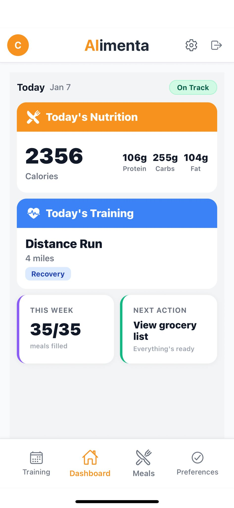
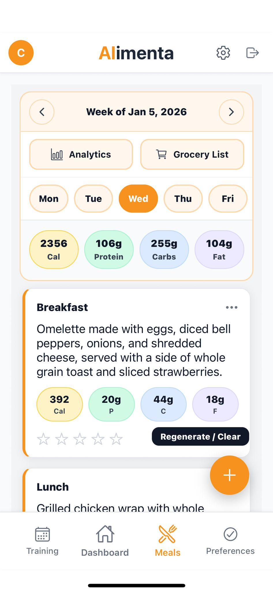
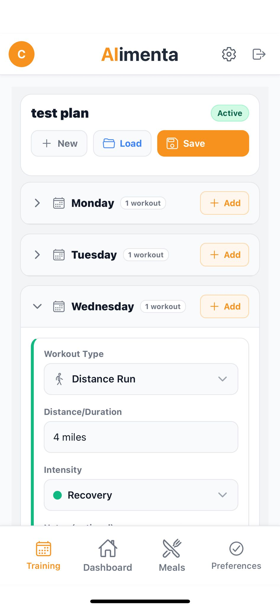

# Alimenta

AI-powered nutrition planning for athletes, with machine learning validation and personalized recommendations.

[Live Demo](https://marathon-nutrition-app.vercel.app/) • [Architecture](#architecture) • [ML Pipeline](#machine-learning-pipeline)

---

## Highlights

- **ML-Validated Nutrition**: 5 specialized models predict macros with 87% accuracy, reducing GPT estimation error by 40%
- **RAG Personalization**: pgvector embeddings learn from meal ratings to improve recommendations over time
- **Real-time Streaming**: Server-sent events deliver meal plans progressively for better UX
- **Production Security**: Row-level security, input sanitization, and role-based access control
- **B2B Architecture**: Multi-tenant system supporting nutritionist-client relationships (in development)

---

## What It Does

Athletes input their training schedule, dietary preferences, and goals. Alimenta generates a personalized weekly meal plan using GPT-4o, then validates every macro prediction through specialized ML models trained on USDA nutritional data. The system learns from user feedback: when you rate meals, those preferences feed into a RAG pipeline that improves future recommendations.

Here is what the meal plan page looks like:

<p align="center">
  
</p>

---

## Architecture

```
┌─────────────────────────────────────────────────────────┐
│              React Frontend (Next.js 14)                │
│         Streaming UI • Custom Hooks • Tailwind          │
└────────────────────────┬────────────────────────────────┘
                         │
                         ▼
┌─────────────────────────────────────────────────────────┐
│            Vercel Serverless Functions                  │
│   SSE Streaming • Auth Middleware • Rate Limiting       │
└───────┬─────────────────────────────┬───────────────────┘
        │                             │
        ▼                             ▼
┌───────────────────┐     ┌───────────────────────────────┐
│    OpenAI API     │     │   ML Validation API (Flask)   │
│   GPT-4o Nano     │     │   5 Specialized Models        │
└───────────────────┘     └───────────────────────────────┘
                │
                ▼
┌─────────────────────────────────────────────────────────┐
│              Supabase (PostgreSQL)                      │
│  ┌─────────────┐  ┌─────────────┐  ┌─────────────────┐  │
│  │ Auth + RLS  │  │ User Data   │  │ pgvector (RAG)  │  │
│  └─────────────┘  └─────────────┘  └─────────────────┘  │
└─────────────────────────────────────────────────────────┘
```

---

## Machine Learning Pipeline

### The Problem
GPT generates creative, contextual meal suggestions but estimates macros poorly—often 30-50% off for complex meals.

### The Solution
Five specialized models trained on distinct meal patterns:

| Model | Calories | Protein | Carbs | Fat | Average |
|-------|----------|---------|-------|-----|---------|
| Breakfast | 91.5% | 90.0% | 86.6% | 82.0% | **87.5%** |
| Lunch | 91.4% | 89.4% | 85.5% | 86.3% | **88.2%** |
| Dinner | 93.1% | 88.9% | 88.2% | 87.3% | **89.4%** |
| Snacks | 76.4% | 89.7% | 74.5% | 87.9% | **82.1%** |
| Desserts | 89.2% | 98.4% | 85.7% | 85.7% | **89.8%** |

*Accuracy = predictions within ±75 cal, ±3g protein, ±10g carbs, ±4g fat*

### Why Separate Models?
Meal types have distinct nutritional patterns. Breakfast skews high-carb (oats, fruit), dinner skews high-protein (larger portions). A single model averaging across these patterns underperforms specialized ones by ~15%.

### Training Pipeline
1. **Data**: 371 foods from USDA FoodData Central
2. **Augmentation**: 5,000+ synthetic meal combinations
3. **Features**: TF-IDF vectorization (200 features, unigrams + bigrams)
4. **Models**: Ensemble of RandomForest + GradientBoosting
5. **Validation**: 80/20 split with cross-validation

---

## RAG Personalization

The system improves recommendations through a feedback loop:

1. User rates generated meals (out of 5 stars)
2. Ratings stored with meal embeddings in pgvector
3. Future meal generation queries similar positive-rated meals
4. Prompt includes relevant user preferences as context

This outperforms simple preference matching because it learns from *actual behavior* rather than stated preferences.

---

## B2B Platform (In Development)

Evolving from individual athlete tool → platform for sports nutritionists:

- **Nutritionist Dashboard**: Manage multiple client meal plans from one interface
- **Client Onboarding**: Invitation-based system with role separation
- **Macro Boundaries**: Nutritionists set limits; AI generates within constraints
- **Separate Views**: Role-based UI adapts to nutritionist vs. client context

Current status: Authentication and basic role separation implemented. Client management features in progress.

This is what the nutritionist dashboard currently looks like:

<p align="center">
  
</p>

---

## Tech Stack

**Frontend**: React 18, Next.js 14, Tailwind CSS, Server-Sent Events

**Backend**: Node.js serverless (Vercel), Flask ML API (Railway → Render)

**Database**: Supabase PostgreSQL, pgvector for embeddings, Row-Level Security

**ML**: scikit-learn, TF-IDF, RandomForest/GradientBoosting ensembles

**DevOps**: GitHub Actions CI/CD, pytest + vitest, automated deployment

---

## Mobile Development

The Alimenta mobile app is built with **Expo** and **React Native**, using **Expo Router** for file-based navigation. It shares auth, data, and API logic with the web app via the `shared/` package (Supabase clients, API client, meal helpers) and talks to the same Next.js API and Supabase backend.

**Stack**: React Native, Expo SDK, Expo Router, shared Supabase/API code, theme support (light/dark).

**Features**: Weekly meal plan with day selector and meal cards, training plan view, food preferences (categories, cuisines, likes/dislikes), profile and settings, onboarding flow, recipe and grocery modals, meal ratings and RAG-powered personalization. Email confirmation deep-links into the app (`alimenta://login`).

The app is currently being tested via **TestFlight** and is expected to be on the **App Store** soon.

Screenshots (iOS):

<p align="center">
  
  
</p>
<p align="center">
  
  
</p>

---

## Project Structure

```
alimenta/
├── _api/                     # Serverless endpoints
│   ├── generate-meals.js     # Main generation + streaming
│   ├── regenerate-meal.js
│   ├── get-recipe.js
│   ├── generate-grocery-list.js
│   ├── rate-meal.js
│   └── get-personalized-preferences.js
├── ml-service/               # Python ML API
│   ├── breakfast/            # Meal-specific models
│   ├── lunch/
│   ├── dinner/
│   ├── snacks/
│   ├── desserts/
│   ├── app.py                # Flask API
│   └── tests/
├── pages/
│   ├── pro/                  # nutritionist view pages
│   └── all other pages       # client/user view pages 
├── src/
│   ├── components/           # React components
│   ├── hooks/                # Custom hooks (data management)
│   ├── context/              # Auth, user state
│   └── services/             # API clients
└── tests/                    # Frontend tests
```

---

## Getting Started

### Prerequisites
- Node.js 18+
- Python 3.11+
- Supabase account
- OpenAI API key

### Installation

```bash
git clone https://github.com/CharlieHanson/marathon-nutrition-app.git
cd marathon-nutrition-app
npm install
```

Create `.env.local`:
```env
NEXT_PUBLIC_SUPABASE_URL=your_supabase_url
NEXT_PUBLIC_SUPABASE_ANON_KEY=your_supabase_key
OPENAI_API_KEY=your_openai_key
```

```bash
npm run dev
```

### ML Service (Optional)
```bash
cd ml-service
python -m venv venv
source venv/bin/activate
pip install -r requirements.txt
python app.py
```

---

## Testing

```bash
npm test                         # Frontend (vitest)
cd ml-service && pytest tests/   # ML API (pytest)
```

CI pipeline runs 23 tests on every push, validates model files, and auto-deploys to Vercel + Railway.

---

## Roadmap

**Current**: Core platform live, B2B features in development

**Next**: Security hardening, nutritionist dashboard completion, beta launch with pilot nutritionists

**Future**: Fitness tracker integrations (Strava, Apple Health), analytics dashboard

---

## Author

**Charlie Hanson** – CS & Business @ Lehigh University

[LinkedIn](https://linkedin.com/in/charliehanson27) • [GitHub](https://github.com/CharlieHanson)