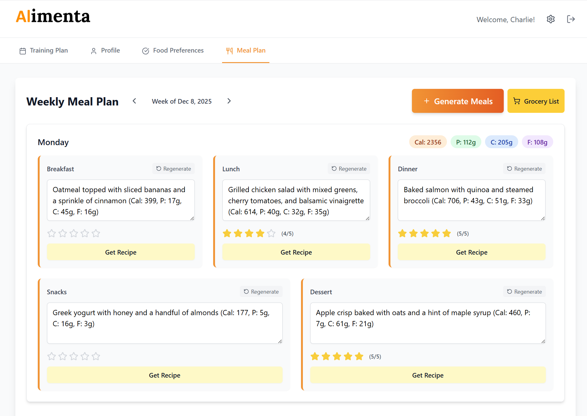
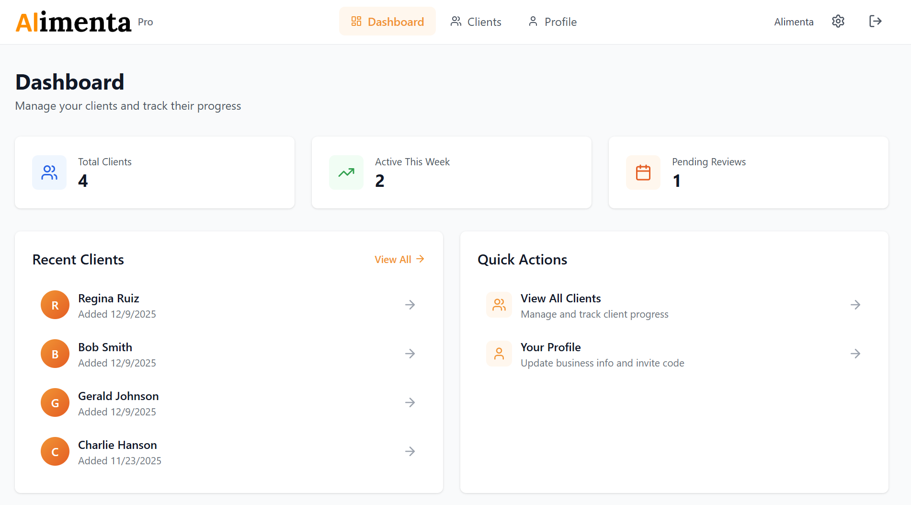
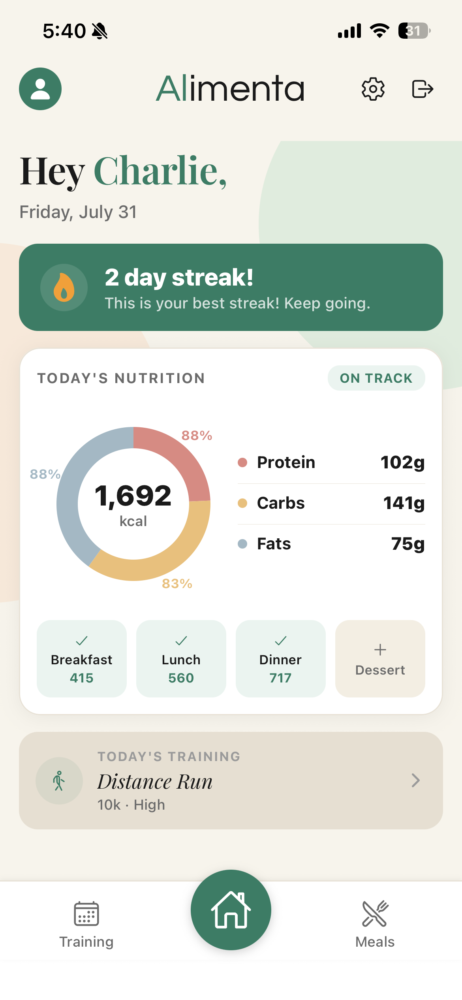
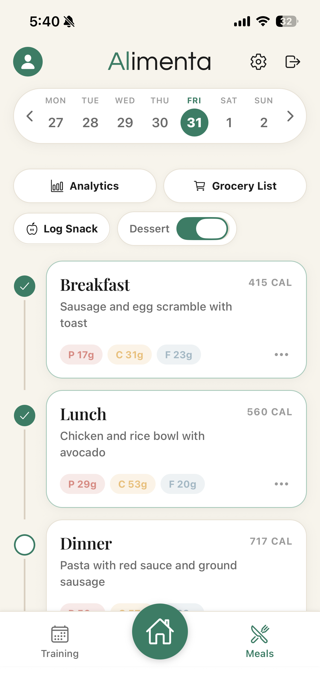
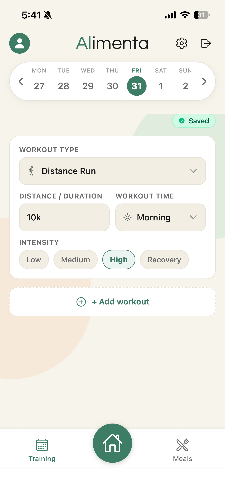
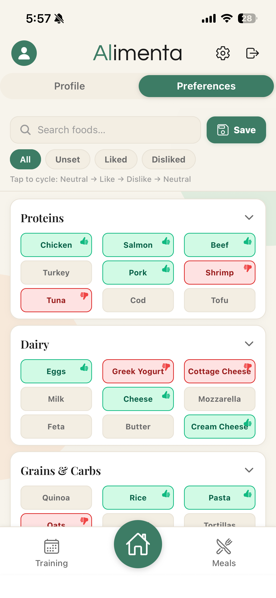

# Alimenta Nutrition

AI-powered nutrition planning for athletes, with machine learning validation and personalized recommendations.

[alimentanutrition.com](https://alimentanutrition.com) • [Architecture](#architecture) • [ML Pipeline](#machine-learning-pipeline)

---

## Highlights

- **ML-Validated Nutrition**: 5 specialized models predict macros with 87% accuracy, reducing AI estimation error by 40%
- **RAG Personalization**: pgvector embeddings learn from meal ratings to improve recommendations over time
- **Real-time Streaming**: Server-sent events deliver meal plans progressively for better UX
- **JWT-Protected API**: Every request verified against a Supabase access token; user identity derived from the JWT, never the request body
- **Production Security**: Row-level security, input sanitization, per-user rate limiting, and role-based access control
- **Cross-Platform**: React Native mobile app (TestFlight → App Store) and Next.js web app share auth, data, and API logic
- **B2B Architecture**: Multi-tenant system supporting nutritionist-client relationships

---

## What It Does

Athletes input their training schedule, dietary preferences, and goals. Alimenta generates a personalized weekly meal plan using Gemini 2.5-flash, then validates every macro prediction through specialized ML models trained on USDA nutritional data. The system learns from user feedback: when you rate meals, those preferences feed into a RAG pipeline that improves future recommendations.

Meal generation runs day-by-day: each day is produced as a single AI call that sees the other meals from that day in context, keeping variety high without programmatic tracking.

Here is what the meal plan page looks like:

<p align="center">
  
</p>

---

## Architecture

```
┌─────────────────────────────────────────────────────────┐
│    Next.js Web (Vercel)   •   React Native Mobile      │
│         Streaming UI • Custom Hooks • Tailwind          │
│              Shared auth, data, and API layer           │
└────────────────────────┬────────────────────────────────┘
                         │  Bearer JWT
                         ▼
┌─────────────────────────────────────────────────────────┐
│           Express API Service (Render)                  │
│   SSE Streaming • JWT Auth • Per-user Rate Limiting     │
└───────┬─────────────────────────────┬───────────────────┘
        │                             │
        ▼                             ▼
┌───────────────────┐     ┌───────────────────────────────┐
│    Gemini +       │     │   ML Validation API (Flask)   │
│   OpenAI models   │     │   5 Specialized Models        │
└───────────────────┘     └───────────────────────────────┘
                │
                ▼
┌─────────────────────────────────────────────────────────┐
│              Supabase (PostgreSQL)                      │
│  ┌─────────────┐  ┌─────────────┐  ┌─────────────────┐  │
│  │ Auth + RLS  │  │ User Data   │  │ pgvector (RAG)  │  │
│  └─────────────┘  └─────────────┘  └─────────────────┘  │
└─────────────────────────────────────────────────────────┘
```

The Next.js frontend and React Native mobile app both authenticate against Supabase, attach the access token as a Bearer header, and call the same Express API. The API verifies the JWT, derives the user identity from the token, applies per-user rate limits, and streams AI responses back over SSE.

---

## Machine Learning Pipeline

### The Problem
Large language models generate creative, contextual meal suggestions but estimate macros poorly — often 30-50% off for complex meals.

### The Solution
Five specialized models trained on distinct meal patterns:

| Model | Calories | Protein | Carbs | Fat | Average |
|-------|----------|---------|-------|-----|---------|
| Breakfast | 91.5% | 90.0% | 86.6% | 82.0% | **87.5%** |
| Lunch | 91.4% | 89.4% | 85.5% | 86.3% | **88.2%** |
| Dinner | 93.1% | 88.9% | 88.2% | 87.3% | **89.4%** |
| Snacks | 76.4% | 89.7% | 74.5% | 87.9% | **82.1%** |
| Desserts | 89.2% | 98.4% | 85.7% | 85.7% | **89.8%** |

*Accuracy = predictions within ±75 cal, ±3g protein, ±10g carbs, ±4g fat*

### Why Separate Models?
Meal types have distinct nutritional patterns. Breakfast skews high-carb (oats, fruit), dinner skews high-protein (larger portions). A single model averaging across these patterns underperforms specialized ones by ~15%.

### Training Pipeline
1. **Data**: 371 foods from USDA FoodData Central
2. **Augmentation**: 5,000+ synthetic meal combinations
3. **Features**: TF-IDF vectorization (200 features, unigrams + bigrams)
4. **Models**: Ensemble of RandomForest + GradientBoosting
5. **Validation**: 80/20 split with cross-validation

---

## RAG Personalization

The system improves recommendations through a feedback loop:

1. User rates generated meals (out of 5 stars)
2. Ratings stored with meal embeddings in pgvector
3. Future meal generation queries similar positive-rated meals
4. Prompt includes relevant user preferences as context

This outperforms simple preference matching because it learns from *actual behavior* rather than stated preferences.

---

## B2B Platform

Alimenta serves two user personas from one platform:

- **Athletes**: individual meal planning driven by training schedule, goals, and preferences
- **Sports nutritionists**: dashboard for managing multiple clients, setting macro boundaries, and reviewing plans

Nutritionist features include client onboarding via invitation, role-based UI that adapts to nutritionist vs. client context, and macro boundary enforcement so AI-generated plans respect nutritionist-set limits.

This is what the nutritionist dashboard looks like:

<p align="center">
  
</p>

---

## Tech Stack

**Frontend (Web)**: React 18, Next.js 14, Tailwind CSS, Server-Sent Events

**Frontend (Mobile)**: React Native, Expo SDK, Expo Router

**API**: Node.js + Express (standalone service on Render), SSE streaming, JWT auth middleware

**AI**: Gemini 2.5-flash (primary meal generation), OpenAI (secondary generation paths and macro estimation), OpenAI embeddings for RAG

**Database**: Supabase PostgreSQL, pgvector for embeddings, Row-Level Security

**ML**: scikit-learn, TF-IDF, RandomForest/GradientBoosting ensembles (Flask API on Render)

**DevOps**: GitHub Actions CI/CD, pytest + vitest, EAS for mobile builds, Vercel for web, Render for API and ML service

---

## Mobile Development

The Alimenta mobile app is built with **Expo** and **React Native**, using **Expo Router** for file-based navigation. It shares auth, data, and API logic with the web app via the `shared/` package (Supabase clients, API client, meal helpers) and talks to the same Express API and Supabase backend.

**Stack**: React Native, Expo SDK, Expo Router, shared Supabase/API code, theme support (light/dark).

**Features**: Weekly meal plan with day selector and meal cards, training plan view, food preferences (categories, cuisines, likes/dislikes), profile and settings, onboarding flow, recipe and grocery modals, meal ratings and RAG-powered personalization, Sign in with Apple, account deletion. Email confirmation deep-links into the app (`alimenta://login`).

The app is currently being tested via **TestFlight** and is expected to launch on the **App Store** soon.

Screenshots (iOS):

<p align="center">
  
  
</p>
<p align="center">
  
  
</p>

---

## Project Structure

```
alimenta/
├── api/                      # Standalone Express API service
│   ├── server.js             # App entry: CORS, auth, route mounting
│   ├── routes/               # Route handlers (meal-plan, profile, pro/*, etc.)
│   ├── handlers/             # Shared handler logic (generation, streaming)
│   └── lib/                  # supabaseAdmin, rateLimiter, requireAuth, RAG, Gemini retry
├── ml-service/               # Python ML API
│   ├── breakfast/            # Meal-specific models
│   ├── lunch/
│   ├── dinner/
│   ├── snacks/
│   ├── desserts/
│   ├── app.py                # Flask API
│   └── tests/
├── mobile/                   # React Native / Expo app
│   ├── app/                  # Expo Router routes
│   ├── components/
│   └── hooks/
├── pages/                    # Next.js pages
│   ├── pro/                  # Nutritionist view pages
│   └── ...                   # Client/user view pages
├── src/
│   ├── components/           # React components
│   ├── hooks/                # Custom hooks (data management)
│   ├── context/              # Auth, user state
│   └── views/                # Page views
├── shared/                   # Cross-platform business logic
│   ├── lib/                  # Supabase clients (web/native), meal helpers
│   └── services/             # API client with JWT attachment
└── docs/                     # Architecture notes, screenshots
```

---

## Getting Started

### Prerequisites
- Node.js 18+
- Python 3.11+
- Supabase account
- OpenAI + Gemini API keys

### Web

```bash
git clone https://github.com/CharlieHanson/marathon-nutrition-app.git
cd marathon-nutrition-app
npm install
```

Create `.env.local`:
```env
NEXT_PUBLIC_SUPABASE_URL=your_supabase_url
NEXT_PUBLIC_SUPABASE_ANON_KEY=your_supabase_anon_key
NEXT_PUBLIC_API_URL=https://your-api-service.onrender.com
```

`NEXT_PUBLIC_API_URL` is the absolute origin of the Express API service — the web client attaches the Supabase JWT and calls it directly.

```bash
npm run dev
```

### API

```bash
cd api
cp .env.example .env
# fill SUPABASE_URL, SUPABASE_SERVICE_ROLE_KEY, SUPABASE_ANON_KEY,
# OPENAI_API_KEY, GEMINI_API_KEY, ML_API_URL, CORS_ORIGINS
npm install
node server.js
```

The `REQUIRE_AUTH` flag gates JWT enforcement — set to `true` in production, off for local testing without tokens.

### Mobile (Expo)

Create `mobile/.env` (see `mobile/.env.example`):
```env
EXPO_PUBLIC_API_URL=https://your-api-service.onrender.com
EXPO_PUBLIC_SITE_URL=https://alimentanutrition.com
EXPO_PUBLIC_SUPABASE_URL=...
EXPO_PUBLIC_SUPABASE_ANON_KEY=...
EXPO_PUBLIC_POSTHOG_KEY=...
EXPO_PUBLIC_POSTHOG_HOST=https://us.i.posthog.com
SENTRY_DSN=...
SENTRY_AUTH_TOKEN=...
SENTRY_ORG=...
SENTRY_PROJECT=...
```

**EAS cloud builds:** set `EXPO_PUBLIC_API_URL`, `EXPO_PUBLIC_SITE_URL`, the Supabase `EXPO_PUBLIC_*` vars, `EXPO_PUBLIC_POSTHOG_KEY`, `EXPO_PUBLIC_POSTHOG_HOST`, `SENTRY_DSN`, `SENTRY_AUTH_TOKEN`, `SENTRY_ORG`, and `SENTRY_PROJECT` as EAS secrets / project environment variables. Values from local `mobile/.env` are **not** included in EAS builds.

### ML Service

```bash
cd ml-service
python -m venv venv
source venv/bin/activate
pip install -r requirements.txt
python app.py
```

---

## Testing

```bash
npm test                         # Frontend (vitest)
cd ml-service && pytest tests/   # ML API (pytest)
```

CI pipeline runs on every push, validates model files, and auto-deploys the web frontend, API service, and ML service to their respective hosts.

---

## Roadmap

**Current**: Web and API in production, mobile app in TestFlight preparing for App Store submission

**Next**: App Store launch, nutritionist onboarding for pilot users, analytics dashboard

**Future**: Fitness tracker integrations (Strava, Apple Health), expanded nutritionist tooling, additional AI model benchmarking

---

## Author

**Charlie Hanson** – CS & Business @ Lehigh University

[LinkedIn](https://linkedin.com/in/charliehanson27) • [GitHub](https://github.com/CharlieHanson)